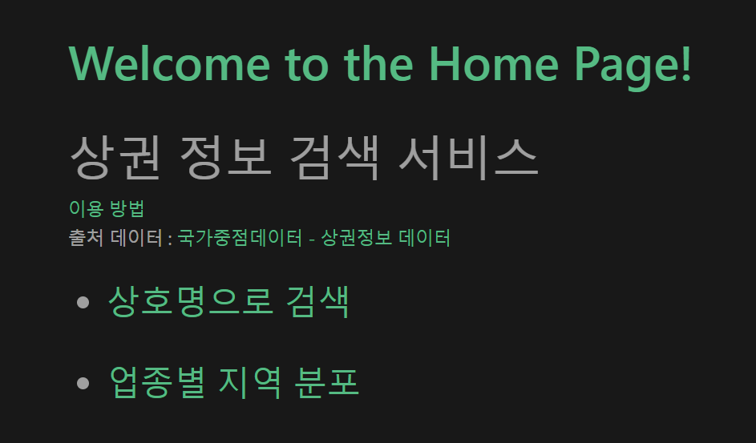

# Flask-Vue3_Practice

- [인턴 가이드라인 참고](https://docs.google.com/document/d/1KRiulTfb3bxYLVlpN6vfGD-cU5dF-siaO-ZXTKAzLwI/edit?usp=sharing)
- 코드 작성자 : 손범준 (2023 HIKE internship)
- 코드 작성일 : 2023-07-07 ~
- 데이터 출처 : [국가중점데이터-상권정보 데이터](https://www.data.go.kr/data/15083033/fileData.do)
- 프로젝트 목적 : flask, vue를 사용해 서울 소상공인 상권 정보 서비스 페이지 구현

----
# Use

- Back-end : Flask / Python

- Front-end : Vue3 / JS

----
# How run?

- ## 가상환경 만들기 
본 프로젝트는 많은 라이브러리가 요구되므로 파이썬 가상환경에서 관리하시는 것이 좋습니다.
```sh
python -m venv venv
```
가상환경을 실행시키고 아래 명령어로 필요한 라이브러리들을 설치해주세요
```sh
pip install -r requirements.txt
```
- ## 데이터 다운로드하기 
-> [국가중점데이터-상권정보 데이터](https://www.data.go.kr/data/15083033/fileData.do) 

위 주소에서 csv파일을 다운로드 받아 압축을 풀고 원하시는 지역의 데이터를 server 폴더 아래에 넣어주세요<br>
(테스트하시려면 서울 지역을 권장합니다)
```python
df = pd.read_csv("소상공인시장진흥공단_상가(상권)정보_서울_202303.csv")
```
다른 지역을 원하시는 경우 server/app.py 파이썬 파일에서 해당 경로/파일명 으로 수정하세요
- ## Back-end 실행하기
루트(프로젝트) 폴더에서 아래 명령어를 실행해 적절한 경로로 가주세요
```sh
cd server
```
<details>
  <summary>혹시 requirements.txt 설치가 안되신다면? (클릭)</summary>
플라스크 설치

```sh 
pip install Flask==2.3.2 Flask-Cors==4.0.0
```
</details>
<br>
아래 명령어로 서버를 실행시키세요

```sh
flask run
```
- ## Front-end 실행하기
루트(프로젝트) 폴더에서 아래 명령어를 실행해 적절한 경로로 가주세요
```sh
cd client
```
<details>
  <summary>vue 설치 방법 (클릭)</summary>
vue 설치

```sh
npm create vue@3.6.1
```
필요한 라이브러리 설치
```sh
npm install
```
</details>

<br>
아래 명령어로 클라이언트를 실행시키세요

```sh
npm run dev
```

----
# 서비스 사용 방법

- ## 홈페이지

성공적으로 실행하셨다면 이렇게 홈페이지가 뜰 것입니다<br>

- ## 상가 정보 검색

여기서는 상호명으로 서울시에 등록된 상가의 정보를 검색하실 수 있습니다<br>

- ## 지역 분포 그래프

여기서는 10가지의 업종 대분류 버튼을 선택하여 해당 지역의 상가 분포를 볼 수 있습니다<br>